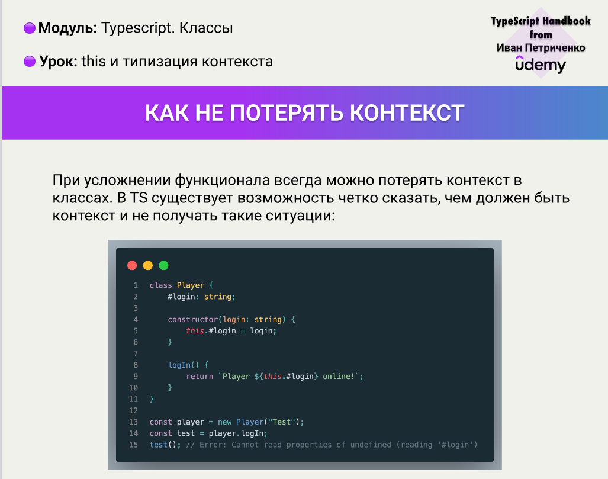
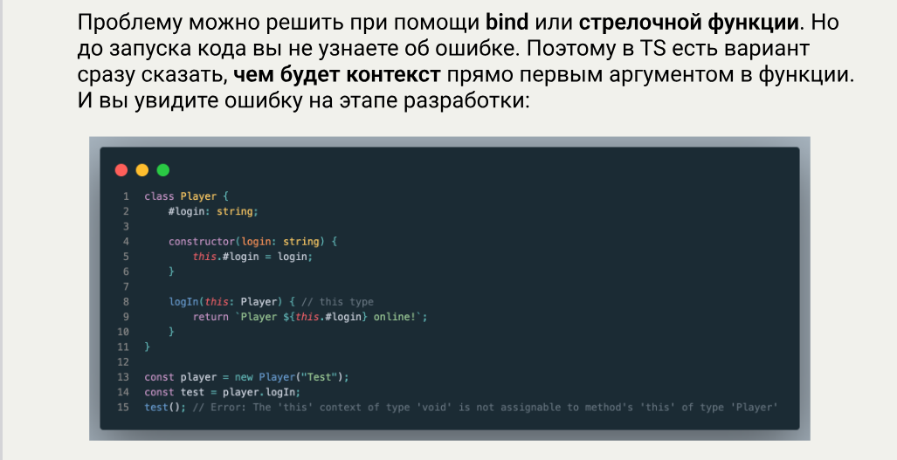
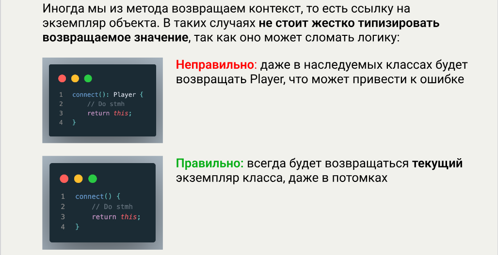
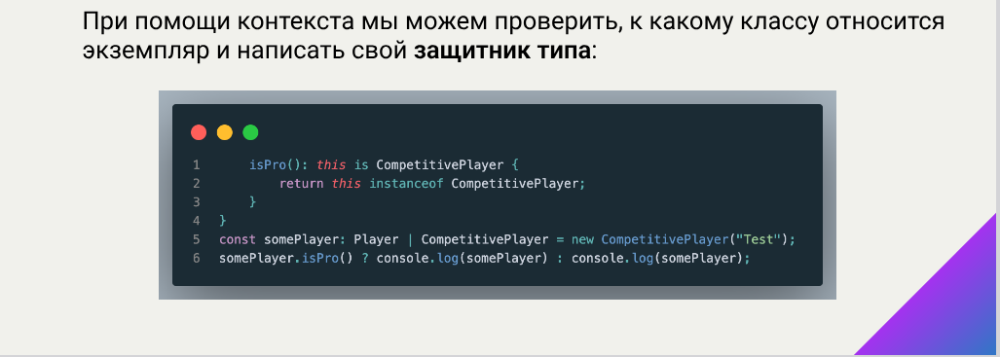

# About

https://campfire-school.com/courses/polnyy-kurs-po-typescript-react/episode/90

Описание эпизода

В этом уроке мы обсудим как лучше работать с контекстом вызова в TS

Ресурсы:

* EN [В документации](https://www.typescriptlang.org/docs/handbook/2/classes.html#this-parameters)

* RU [В руководстве](https://scriptdev.ru/guide/026/)

* Конспект

# Demo

[index.ts](demo/index.ts)

Примеры "-10-".."-40-" соответствуют конспекту (измененные примеры).

Демо "-50-" "Type Guard" не реализовано т.к. не получается придумать ПРАВИЛЬНЫЙ пример.