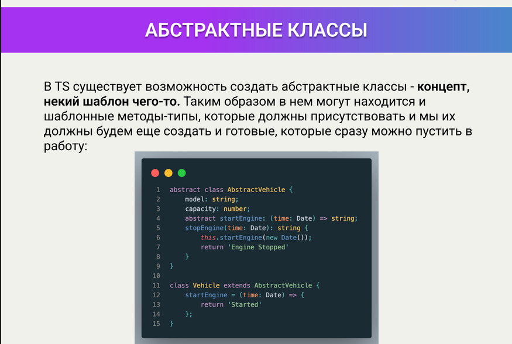
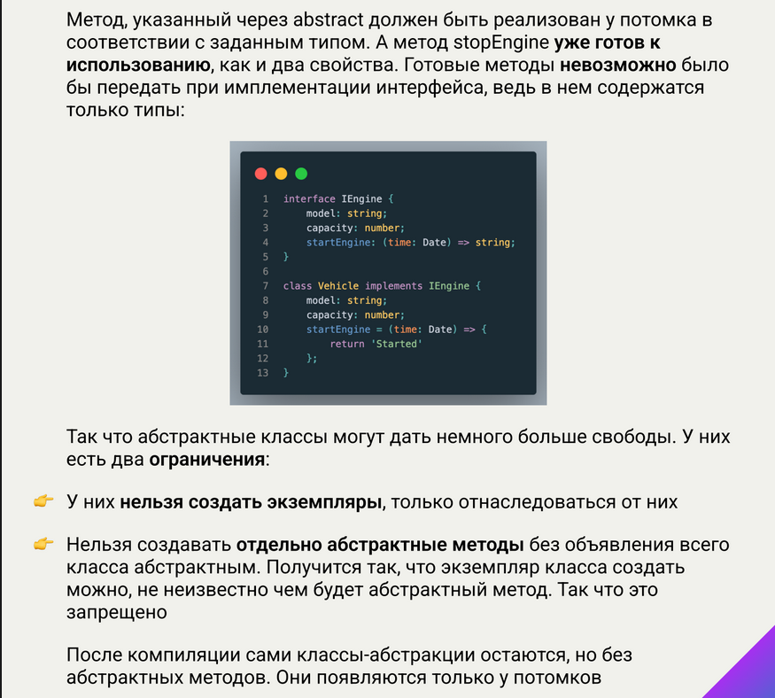

# About

https://campfire-school.com/courses/polnyy-kurs-po-typescript-react/episode/91

Описание эпизода

В этом уроке мы обсудим абстрактные классы и методы в TypeScript

Ресурсы:

* EN [В документации](https://www.typescriptlang.org/docs/handbook/2/classes.html#abstract-classes-and-members)

* RU [В руководстве](https://scriptdev.ru/guide/025/)

* Конспект





# Demo

[index.ts](demo/index.ts)

```typescript
abstract class AbstractCar {
    model: string = '';

    abstract prepare(): boolean;

    start(): void {
        console.log('AbstractCar.start');
        this.prepare();
        console.log('AbstractCar.start', 'Поехали');
    }
}

class GasCar extends AbstractCar {
    // Абстрактные методы допустимы только в абстрактном классе
    //abstract checkTires(): void; //error TS1244: Abstract methods can only appear within an abstract class.

    override prepare(): boolean {
        console.log('GasCar.prepare', 'Проверить уровень масла в двигателе');
        console.log('GasCar.prepare', 'Проверить уровень охлаждающей жидкости в бачке');
        return true;
    }
}

class ElectricCar extends AbstractCar {
    override prepare(): boolean {
        console.log('ElectricCar.prepare', 'Проверить заряд аккумуляторов');
        return true;
    }
}

// Объект абстрактного класса создать нельзя.
//const car = new AbstractCar(); //  error TS2511: Cannot create an instance of an abstract class.

(() => {
    console.log('-- GasCar');
    const car = new GasCar();
    car.start();
})();

(() => {
    console.log('-- ElectricCar');
    const car = new ElectricCar();
    car.start();
})();

/*
-- GasCar
AbstractCar.start
GasCar.prepare Проверить уровень масла в двигателе
GasCar.prepare Проверить уровень охлаждающей жидкости в бачке
AbstractCar.start Поехали

-- ElectricCar
AbstractCar.start
ElectricCar.prepare Проверить заряд аккумуляторов
AbstractCar.start Поехали
*/
```