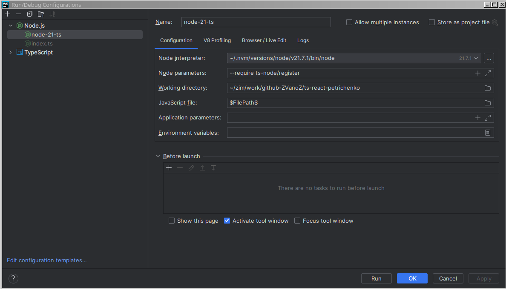

## Содержание

**Полный курс по Typescript + React**

---

**Введение**

9. [Про этот курс](https://campfire-school.com/courses/polnyy-kurs-po-typescript-react/episode/9)
10. [Как проходить данный курс](https://campfire-school.com/courses/polnyy-kurs-po-typescript-react/episode/10)
11. [Про закрытый чат, редакторы кода, материалы и ссылки + конспект по TS](https://campfire-school.com/courses/polnyy-kurs-po-typescript-react/episode/11)
12. [Дополнительно: настройка рабочего пространства](https://campfire-school.com/courses/polnyy-kurs-po-typescript-react/episode/12)
13. [Дополнительно: Установка автоматического форматирования](https://campfire-school.com/courses/polnyy-kurs-po-typescript-react/episode/13)

---

**Typescript. Базовые знания**

[10-base](20-ts/10-base)

14. [Что такое TypeScript и зачем он нужен](https://campfire-school.com/courses/polnyy-kurs-po-typescript-react/episode/14)
15. [Установка TS и запуск файлов](https://campfire-school.com/courses/polnyy-kurs-po-typescript-react/episode/15)
16. [Базовые типы: строка, число, логическое значение](https://campfire-school.com/courses/polnyy-kurs-po-typescript-react/episode/16)
17. [Использование системы типов в функциях](https://campfire-school.com/courses/polnyy-kurs-po-typescript-react/episode/17)
18. [Специальный тип any](https://campfire-school.com/courses/polnyy-kurs-po-typescript-react/episode/18)
19. [Практика типизации кода](https://campfire-school.com/courses/polnyy-kurs-po-typescript-react/episode/19)
20. [Тип never](https://campfire-school.com/courses/polnyy-kurs-po-typescript-react/episode/20)
21. [Типы null и undefined](https://campfire-school.com/courses/polnyy-kurs-po-typescript-react/episode/21)
22. [(д) Редкие примитивные типы bigint, symbol](https://campfire-school.com/courses/polnyy-kurs-po-typescript-react/episode/22)
23. [Типизация объектов и деструктуризация](https://campfire-school.com/courses/polnyy-kurs-po-typescript-react/episode/23)
24. [Типизация массивов](https://campfire-school.com/courses/polnyy-kurs-po-typescript-react/episode/24)
25. [Практика типизации кода](https://campfire-school.com/courses/polnyy-kurs-po-typescript-react/episode/25)
26. [Tuples (Кортежи)](https://campfire-school.com/courses/polnyy-kurs-po-typescript-react/episode/26)
27. [Union (Объединение)](https://campfire-school.com/courses/polnyy-kurs-po-typescript-react/episode/27)
28. [Сужение типов (Narrowing)](https://campfire-school.com/courses/polnyy-kurs-po-typescript-react/episode/28)
29. [Примитивные литеральные типы (Literal types)](https://campfire-school.com/courses/polnyy-kurs-po-typescript-react/episode/29)
30. [Псевдонимы типов (Type aliases)](https://campfire-school.com/courses/polnyy-kurs-po-typescript-react/episode/30)    
    [src](./20-ts/10-base/160-type-aliases/index.ts)
32. [Объектные литералы и аннотации функций](https://campfire-school.com/courses/polnyy-kurs-po-typescript-react/episode/31)
32. [Проверка знаний](https://campfire-school.com/courses/polnyy-kurs-po-typescript-react/episode/32)

---

**Typescript. Необходимый уровень**

[20-necessery](20-ts/20-necessery)

33. [Более продвинутый Type и пересечение типов (Intersection)](https://campfire-school.com/courses/polnyy-kurs-po-typescript-react/episode/33)  
    [src](./20-ts/20-necessery/010-intersection)
35. [Интерфейсы (Interfaces)](https://campfire-school.com/courses/polnyy-kurs-po-typescript-react/episode/34)  
    [src](./20-ts/20-necessery/020-interface)
36. [Type или Interface?](https://campfire-school.com/courses/polnyy-kurs-po-typescript-react/episode/35)
37. [Практика работы с интерфейсами и типами](https://campfire-school.com/courses/polnyy-kurs-po-typescript-react/episode/36)  
    [src](./20-ts/20-necessery/030-practice)
38. [Механизм вывода типов (Type Inference)](https://campfire-school.com/courses/polnyy-kurs-po-typescript-react/episode/37)
    [src](./20-ts/20-necessery/040-type-inference)
38. [Модификаторы свойств: optional (Property Modifiers)](https://campfire-school.com/courses/polnyy-kurs-po-typescript-react/episode/38)
    [src](./20-ts/20-necessery/050-property-modifiers)
39. [(д) Оператор Non-Null and Non-Undefined](https://campfire-school.com/courses/polnyy-kurs-po-typescript-react/episode/39)  
    [src](./20-ts/20-necessery/060-non-null-and-non-undefined)
40. [Модификаторы свойств: readonly (Property Modifiers)](https://campfire-school.com/courses/polnyy-kurs-po-typescript-react/episode/40)  
    [src](./20-ts/20-necessery/070-readonly)
41. [Enums](https://campfire-school.com/courses/polnyy-kurs-po-typescript-react/episode/41)  
    [src](./20-ts/20-necessery/080-enum)
42. [Проблемы использования Enum](https://campfire-school.com/courses/polnyy-kurs-po-typescript-react/episode/42)  
    [src](./20-ts/20-necessery/090-enum-trubles)
43. [Тип Unknown](https://campfire-school.com/courses/polnyy-kurs-po-typescript-react/episode/43)  
    [src](./20-ts/20-necessery/100-type-unknown)
44. [Запросы типов](https://campfire-school.com/courses/polnyy-kurs-po-typescript-react/episode/44)  
    [src](./20-ts/20-necessery/110-type-queries)
45. [Практика](https://campfire-school.com/courses/polnyy-kurs-po-typescript-react/episode/45)  
    [src](./20-ts/20-necessery/120-practice)
46. [Утверждение типов (Type Assertions)](https://campfire-school.com/courses/polnyy-kurs-po-typescript-react/episode/46)  
    [src](./20-ts/20-necessery/130-type-assertions)
47. [Немного про “внутренние” типы и приведение типов](https://campfire-school.com/courses/polnyy-kurs-po-typescript-react/episode/47)  
    [src](./20-ts/20-necessery/140-type-casting)
48. [Type Guard](https://campfire-school.com/courses/polnyy-kurs-po-typescript-react/episode/48)
    [src](./20-ts/20-necessery/190-practice-typeguard-interfaces)
49. [Кейс использования never](https://campfire-school.com/courses/polnyy-kurs-po-typescript-react/episode/49)
50. [Перегрузка функций](https://campfire-school.com/courses/polnyy-kurs-po-typescript-react/episode/50)
51. [Разделение интерфейсов на правильные части](https://campfire-school.com/courses/polnyy-kurs-po-typescript-react/episode/51)
52. [Практика создания type guard и правильных интерфейсов](https://campfire-school.com/courses/polnyy-kurs-po-typescript-react/episode/52)
53. [Работа с DOM](https://campfire-school.com/courses/polnyy-kurs-po-typescript-react/episode/53)
54. [Практика работы с DOM](https://campfire-school.com/courses/polnyy-kurs-po-typescript-react/episode/54)
55. [(д) Использование void внутри TS](https://campfire-school.com/courses/polnyy-kurs-po-typescript-react/episode/55)
56. [Проверка знаний №2 | TypeScript + React](https://campfire-school.com/courses/polnyy-kurs-po-typescript-react/episode/56)

---

**Typescript. Generics and type manipulations**

[30-generics-manipulation](20-ts/30-generics-manipulation)

57. * [x] [Введение в этот модуль](https://campfire-school.com/courses/polnyy-kurs-po-typescript-react/episode/57)
58. * [x] [Generics (Обобщения),что это и зачем нужно](https://campfire-school.com/courses/polnyy-kurs-po-typescript-react/episode/58)   
    [readme.md](20-ts/30-generics-manipulation/010-entry/readme.md)
59. * [x] [Generics functions](https://campfire-school.com/courses/polnyy-kurs-po-typescript-react/episode/59)  
    [readme.md](20-ts/30-generics-manipulation/20-generics-functions/readme.md)
60. * [x] [Generics types and interfaces, constraints](https://campfire-school.com/courses/polnyy-kurs-po-typescript-react/episode/60)  
    [readme.md](./20-ts/30-generics-manipulation/030-generics-types-interfaces-constraints/readme.md)
61. * [x] [Практика](https://campfire-school.com/courses/polnyy-kurs-po-typescript-react/episode/61)  
    [readme.md](./20-ts/30-generics-manipulation/040-generics-types-practice/readme.md)
62. * [x] [Generics classes](https://campfire-school.com/courses/polnyy-kurs-po-typescript-react/episode/62)  
    [src](./20-ts/30-generics-manipulation/050-generics-classes)
63. * [x] [Native generics](https://campfire-school.com/courses/polnyy-kurs-po-typescript-react/episode/63)  
    [src](./20-ts/30-generics-manipulation/060-native-generics)
64. * [x] [Type manipulation intro](https://campfire-school.com/courses/polnyy-kurs-po-typescript-react/episode/64)  
    ~~[src](./20-ts/30-generics-manipulation/070-type-manipulation-intro)~~
65. * [x] [keyof](https://campfire-school.com/courses/polnyy-kurs-po-typescript-react/episode/65)  
    [src](./20-ts/30-generics-manipulation/080-keyof)
66. * [x] [Оператор typeof и снова запросы типов](https://campfire-school.com/courses/polnyy-kurs-po-typescript-react/episode/66)  
    [src](./20-ts/30-generics-manipulation/090-keyof-typeof-object)
67. * [x] [Indexed Access Types](https://campfire-school.com/courses/polnyy-kurs-po-typescript-react/episode/67)  
    [src](./20-ts/30-generics-manipulation/100-indexed-access-types)
68. * [x] [practice](https://campfire-school.com/courses/polnyy-kurs-po-typescript-react/episode/68)  
    [src](./20-ts/30-generics-manipulation/110-practice)
69. * [x] [Conditional types and infer](https://campfire-school.com/courses/polnyy-kurs-po-typescript-react/episode/69)  
    [src](./20-ts/30-generics-manipulation/120-conditional-types-and-infer)
70. * [x] [Mapped types, +/- операторы](https://campfire-school.com/courses/polnyy-kurs-po-typescript-react/episode/70)  
    [src](./20-ts/30-generics-manipulation/130-mapped-types)
71. * [x] [Template literal types](https://campfire-school.com/courses/polnyy-kurs-po-typescript-react/episode/71)  
    [src](./20-ts/30-generics-manipulation/140-template-literal-types)
72. * [x] [Utility types: Pick, Omit, Extract, Exclude, Record](https://campfire-school.com/courses/polnyy-kurs-po-typescript-react/episode/72)  
    [src](./20-ts/30-generics-manipulation/150-utility-types)
73. * [ ] [Практика](https://campfire-school.com/courses/polnyy-kurs-po-typescript-react/episode/73)  
    [src](./20-ts/30-generics-manipulation/160-practice)
74. * [ ] [Практика - Разбор задач](https://campfire-school.com/courses/polnyy-kurs-po-typescript-react/episode/74)  
      [src](./20-ts/30-generics-manipulation/160-practice/teacher)
75. * [x] [Дополнительные вспомогательные типы (Utility types)](https://campfire-school.com/courses/polnyy-kurs-po-typescript-react/episode/75)  
      [src](./20-ts/30-generics-manipulation/170-utility-types)
76. * [x] [Работа с запросами на сервер, Promise и JSON](https://campfire-school.com/courses/polnyy-kurs-po-typescript-react/episode/76)  
      [src](./20-ts/30-generics-manipulation/180-promise-and-json)
77. * [x] [Awaited](https://campfire-school.com/courses/polnyy-kurs-po-typescript-react/episode/77)  
      [src](./20-ts/30-generics-manipulation/190-awaited)
---

**Typescript. Классы.**

[40-classes](20-ts/40-classes)

79. * [x] Введение в этот модуль  
[src](20-ts/40-classes/010-intro)


80. * [x] Базовая работа с классом, опции компиляции в "tsconfig.json", опция "strictPropertyInitialization".  
[src](20-ts/40-classes/020-classes-ts)

81. * [x] Конструкторы, перегрузки и дженерики.  
      [src](20-ts/40-classes/020-classes-ts)

---

## Настройка WebStorm



````text
-------------------------------------------------------------------------------
Name              :    node-21-ts                                             : 
Node inpreter     :    /home/ivan/.nvm/versions/node/v21.7.1/bin/node         : 
Node parameters   :    --require ts-node/register                             : 
Working directory :    ~/zim/work/github-ZVanoZ/ts-react-petrichenko          : 
JavaScript file   :    $FilePath$                                             : Текущий файл в редакторе IDE. 
                  :                                                           : Перед запуском нужно активировать таб с редактором.
-------------------------------------------------------------------------------
````

[Список подстановок, которые предусмотрены в IDE](https://www.jetbrains.com/help/objc/built-in-macros.html)

````text
-------------------------------------------------------------------------------

-- для опции Working directory
-- !!! @TODO: разобраться как использовать подстановочные переменные для этой опции
$ContentRoot$                     The path to the content root to which the current file belongs.
$FileDir$                         The absolute path to the directory that contains the current file.
$FileDirName$                     ??? The name of the directory that contains the current file.
$FileDirPathFromParent(dir)$      The path to the directory that contains the current file relative to a parent directory specified as the parameter dir.
$FileDirRelativeToProjectRoot$    The path to the directory that contains the current file relative to the module's content root.
$FileParentDir$                   The name of the parent directory to the directory where the current file is located.
$FileRelativeDir$                 The path to the directory where the current file is located relative to the module's content root.
$ModuleFileDir$                   The absolute path to the directory where the current module file is located.
$ProjectFileDir$                  The absolute path to the current project directory.
$Projectpath$                     The current project's source path.

-- для опции "JavaScript file"
$FilePath$                        The absolute path to the current file.
$FilePathRelativeToProjectRoot$   The path to the current file relative to the module's content root.
$FilePrompt$                      Shows the file system dialog to select the file.
$FileRelativePath$                The path to the current file relative to the module's content root.

-------------------------------------------------------------------------------
````